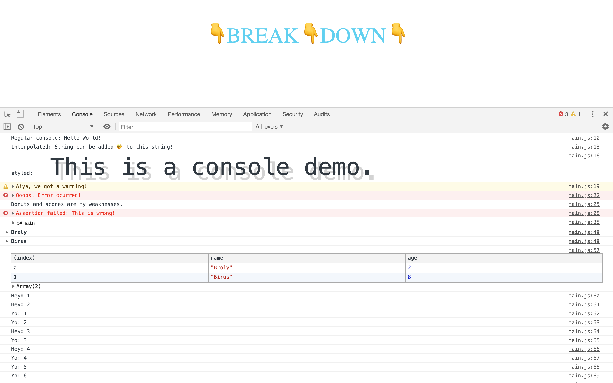

# 09. Dev tools domination

#### _Dev Tools Domination by JavaScript30 10/09/19_

## Description
This is Dev Tools Domination demo, 9th application out of 30 by 30 day Vanilla JavaScript Coding Challenge by Wes Bos.<br>
Please check the challenge from [JavaScript30](http://wesbos.com/javascript30/).




## About this Application:
- When you click the paragraph, the font color will change to blue and the font size gets bigger.
- has 10 different console demo:
    1. Regular `console.log()`
    2. Interpolated console using `%s`. It takes a string as a second argument.
    3. Styled using console using `%c`. It takes css properties as a second argument.
    4. `console.warn()` - prints a warning in the console.
    5. `console.error()` - prints an error message.
    6. `console.info()` - you'll see a info sign. If you use Chrome, make sure info in 'Default Levels' is checked.
    7. `console.assert()` - takes an error message as second argument (optional) and prints it when the test fails. It prints nothing if the test passes.
    8. `console.clear()` - clears out the console. This is commented out since it'll clears up all the code above the line. Please uncomment this line to see how this works.
    9. `console.dir()` - shows all the methods and properties that the DOM has. Open the dropdown and check all the elements!
    10. `console.groupCollapsed()` - grouping the info by each element. You can also use `console.group()`. When you call `console.groupEnd()` with the same value, it ends the grouping.
    11. `console.table()` - shows the passed data in table format.
    12. `console.count()` - counts how many times the value was passed.
    13. `console.time()` - starts a timer you can use to track how long an operation takes. When you call `console.timeEnd()` with the same value, the browser output the time.


## Setup/Installation Requirements

1. Clone this repo:
```
$ git clone https://github.com/misakimichy/JS30-09-dev-tools-domination.git
```

2. Navigate to the top level of the cloned directory.

3. Open `index.html` with your preferred web browser.

4. Open the browser console.

## Known Bugs
* No known bugs at this time.

## Support and contact details
 I welcome any feedbacks and comments: misaki.koonce@gmail.com

## Technologies Used
_Git, GitHub, HTML, CSS, Vanilla JavaScript

## License
Copyright © 2019 under the MIT License